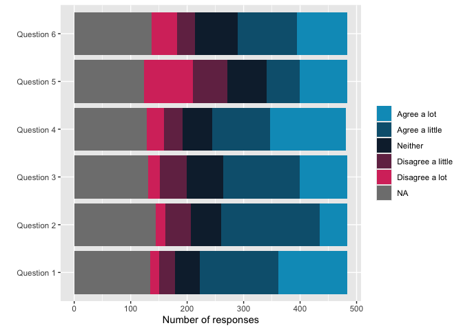

<!-- README.md is generated from README.Rmd. Please edit that file -->

# OMESurvey

<!-- badges: start -->
<!-- badges: end -->

📦 The `OMESurvey` package contains tools for analysing survey data for
the OME, in particular (for now) converting raw survey data into
publishable excel workbooks.

## Installation

You can install the development version of OMESurvey from
[GitHub](https://github.com/) with:

``` r
# install.packages("devtools")
devtools::install_github("Jake-Powell/OMESurvey")
```

## Examples

Creating survey results for a given theme

``` r
library(OMESurvey)
data = OMESurvey::survey_example

OMESurvey::plot_theme(data, theme = 'Theme_1', kind = 'ggplot')
```


