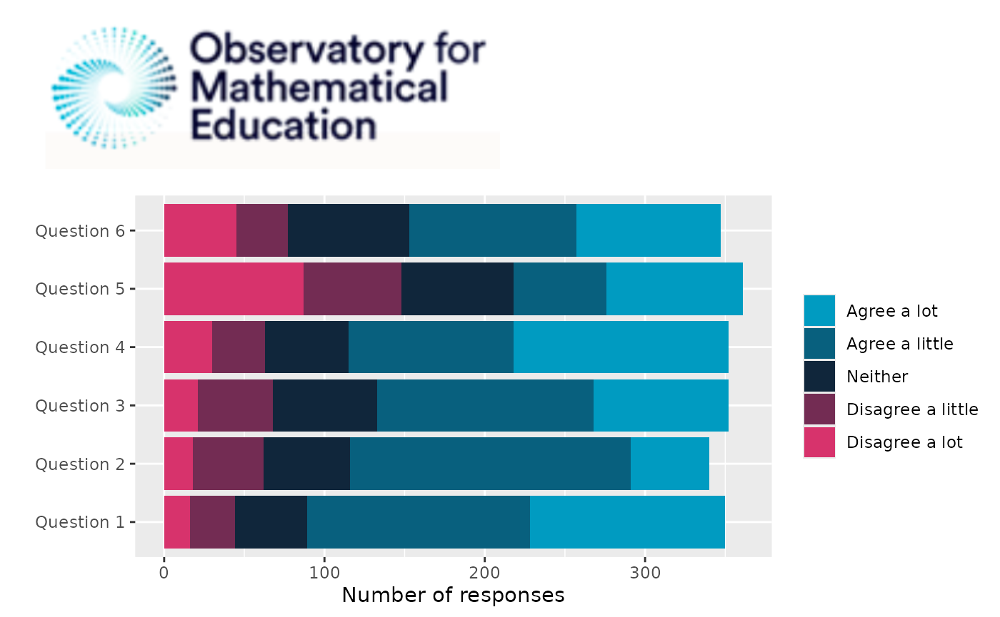
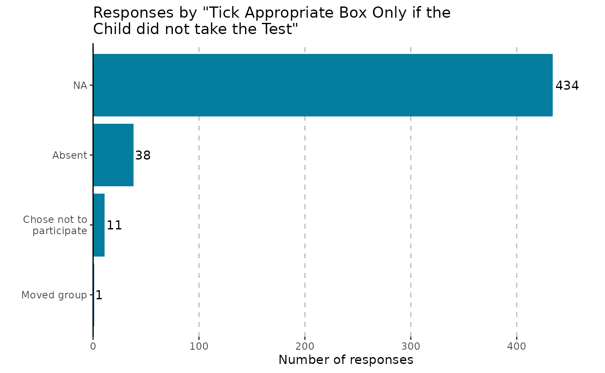

# Create survey figures

``` r
library(OMESurvey)
```

*This vignette provides examples for the simple creation of survey plots
across different output types*

``` r
data = OMESurvey::survey_example

# Clean such that "N-A" values equal NA, fix any casing issues
for(i in 1:ncol(data)){
  data[,i][data[,i] == 'N-A'] = NA
  data[,i] = data[,i] |> stringr::str_to_sentence() 
}
```

## Number of responses across questions in a theme

In this case we can use
[`plot_theme()`](https://jake-powell.github.io/OMESurvey/reference/plot_theme.md)
to create a horizontal bar chart. Depending on the “Kind” argument we
can create a ggplot, a plotly figure or a formatted data frame.

### 

- ggplot
- plotly
- data.frame

``` r
OMESurvey::plot_theme(data, theme = 'Theme_1', kind = 'ggplot')
```


``` r
OMESurvey::plot_theme(data, theme = 'Theme_1', kind = 'plotly')
```

``` r
df = OMESurvey::plot_theme(data, theme = 'Theme_1', kind = 'data.frame')
df |> DT::datatable(extensions = 'Buttons',
                  rownames = F,
                  options = list(scrollY = 300,
                                 dom = 'Bt',
                                 buttons = c('copy', 'csv', 'excel', 'pdf'),
                                 paging=FALSE,
                                 ordering=F))
```

### 

Note that here we use default `survey_values = OMESurvey::survey_values`
is used to find the expected values of the survey questions and the
order to show the answers in the legend. For custom survey values you
can change the `survey_values`. The function uses colours from
[`OMESurvey::get_OME_colours()`](https://jake-powell.github.io/OMESurvey/reference/get_OME_colours.md).
For the plots either a ggplot or plotly object are returned, therefore +
or \|\> can be used to update the plot (e.g layout/colours, etc). Or you
can create your own plot from the data frame output.

For example if you want to swap the bar order but keep the same
colourscheme.

``` r
# Use custom survey_values with the order of the values reversed
p = OMESurvey::plot_theme(data, theme = 'Theme_1', kind = 'ggplot',
                      survey_values = list(agree = c("Agree a lot", "Agree a little", "Neither",           "Disagree a little", "Disagree a lot") |> rev()))

# Get OME colours
colo = get_OME_colours(n = 5, type = 'contrast') 
# Swap to the original colour order
p + ggplot2::scale_fill_manual(values = colo |> rev(), guide = ggplot2::guide_legend(reverse = TRUE)) 
#> Scale for fill is already present.
#> Adding another scale for fill, which will replace the existing scale.
```


Note further a warning will be given if the answers to the questions do
not align with the survey values. Where the unexpected answers will be
set to NA (for ggplot).

``` r
data_issue = data
data_issue$Theme_1__Question_1[1] = 'Ohh Dear...'

# Use custom survey_values with the order of the values reversed
OMESurvey::plot_theme(data_issue, theme = 'Theme_1', kind = 'ggplot')
#> Warning in OMESurvey::plot_theme(data_issue, theme = "Theme_1", kind =
#> "ggplot"): The expected answers are: "Agree a lot", "Agree a little",
#> "Neither", "Disagree a little", "Disagree a lot" which does not include the
#> following found in the data: "Ohh Dear..."
```


------------------------------------------------------------------------

## Number of responses across questions in a theme with a demographic

Need to add a demographic column so extract school from the bar code.

``` r
school = data$Barcode_ID |> as.character() |>  substr(3, 5)
data$school = school
school_column = ncol(data)
```

### 

- ggplot
- plotly
- data.frame

``` r
OMESurvey::plot_theme_by_demographic(data, theme = 'Theme_1', demographic_column = school_column,  kind = 'ggplot')
```


``` r
OMESurvey::plot_theme_by_demographic(data, theme = 'Theme_1', demographic_column = school_column,  kind = 'plotly')
```

``` r
# Get school information
df = OMESurvey::plot_theme_by_demographic(data, theme = 'Theme_1', demographic_column = school_column,  kind = 'data.frame')

df |> DT::datatable(extensions = 'Buttons',
                  rownames = F,
                  options = list(scrollY = 300,
                                 dom = 'Bt',
                                 buttons = c('copy', 'csv', 'excel', 'pdf'),
                                 paging=FALSE,
                                 ordering=F))
```

### 

## Adding OME logo to ggplot

You can also add the OME logo to ggplot objects using
[`add_logo()`](https://jake-powell.github.io/OMESurvey/reference/add_logo.md).

Note however to do this we use the gridExtra::grid.arrange() function to
add the logo into the margin which causes the object to no longer be a
ggplot object. Thus, you cannot use ‘+’ to change the plot after adding
the logo.

``` r
# Add logo.
OMESurvey::plot_theme(data, theme = 'Theme_1', kind = 'ggplot') |> OMESurvey::add_logo()
```


``` r

# Add logo, speciify position.
OMESurvey::plot_theme(data, theme = 'Theme_1', kind = 'ggplot') |> OMESurvey::add_logo(position = 'top right')
```


``` r

# Add logo, speciify position and sizing arguement.
OMESurvey::plot_theme(data, theme = 'Theme_1', kind = 'ggplot') |> OMESurvey::add_logo(position = 'top left',logo_sizing = c(0.3, 0.5))
```



## Formatted bar charts from data column

We can use
[`plot_bar()`](https://jake-powell.github.io/OMESurvey/reference/plot_bar.md)
to create bar charts of a single column within survey data.

### 

- ggplot
- plotly
- data.frame

``` r
OMESurvey::plot_bar(data, column = 5, kind = 'ggplot')
#> Warning: The `size` argument of `element_line()` is deprecated as of ggplot2 3.4.0.
#> ℹ Please use the `linewidth` argument instead.
#> ℹ The deprecated feature was likely used in the OMESurvey package.
#>   Please report the issue to the authors.
#> This warning is displayed once per session.
#> Call `lifecycle::last_lifecycle_warnings()` to see where this warning was
#> generated.
```


``` r
OMESurvey::plot_bar(data, column = 5, kind = 'plotly')
```

``` r
df = OMESurvey::plot_bar(data, column = 5, kind = 'data.frame')
df |> DT::datatable(extensions = 'Buttons',
                  rownames = F,
                  options = list(scrollY = 300,
                                 dom = 'Bt',
                                 buttons = c('copy', 'csv', 'excel', 'pdf'),
                                 paging=FALSE,
                                 ordering=F))
```

### 

Note that you can include NA in the bar charts by using passing
arguments to [`table()`](https://rdrr.io/r/base/table.html) via `...`.
Moreover, for ggplot outputs we can include numbers on the plot y
setting `showValue = TRUE`.

``` r
OMESurvey::plot_bar(data, column = 5, kind = 'ggplot', showValue = TRUE, useNA = 'always')
#> Scale for y is already present.
#> Adding another scale for y, which will replace the existing scale.
```


