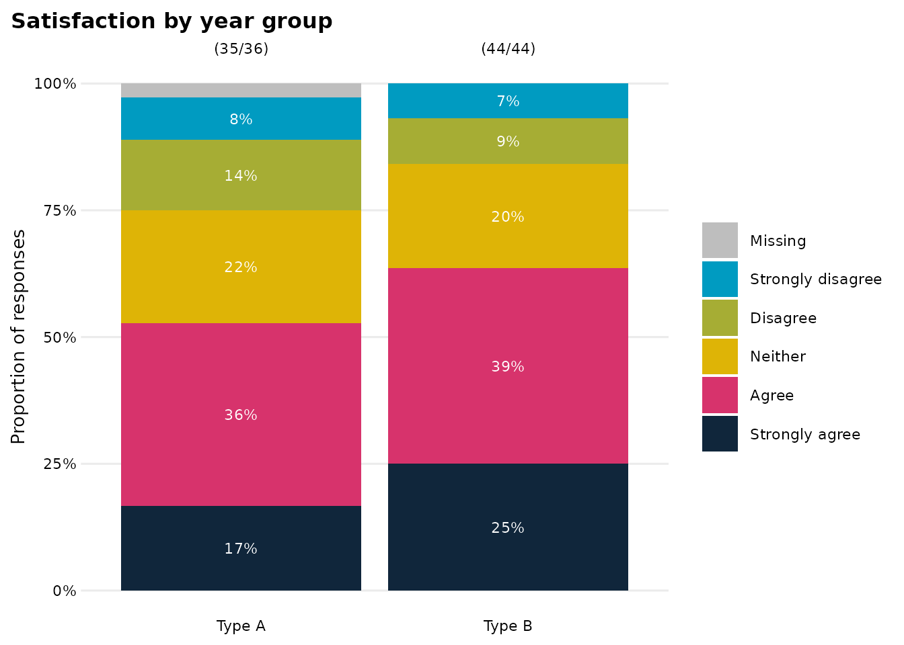
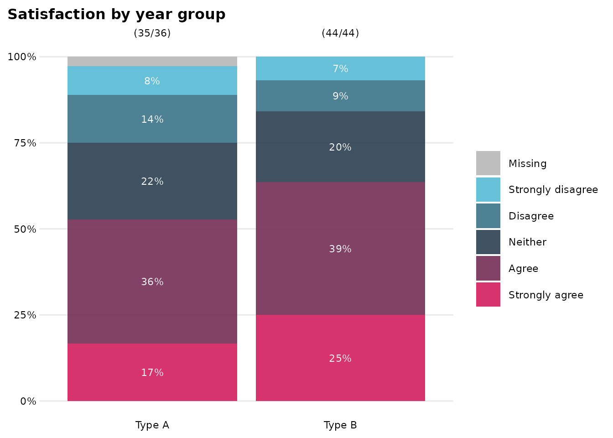
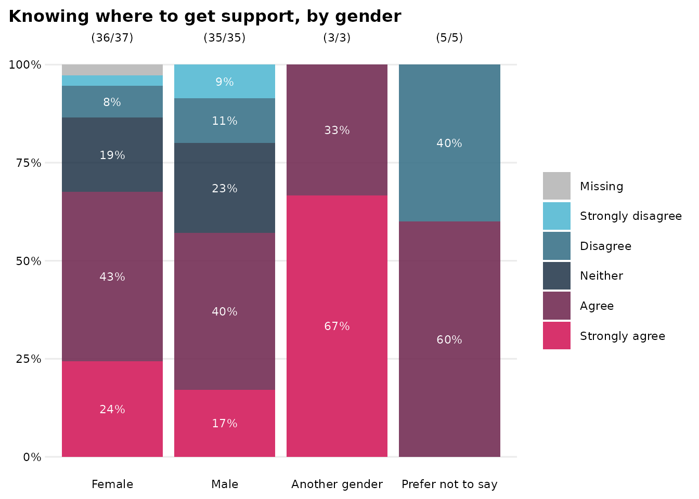
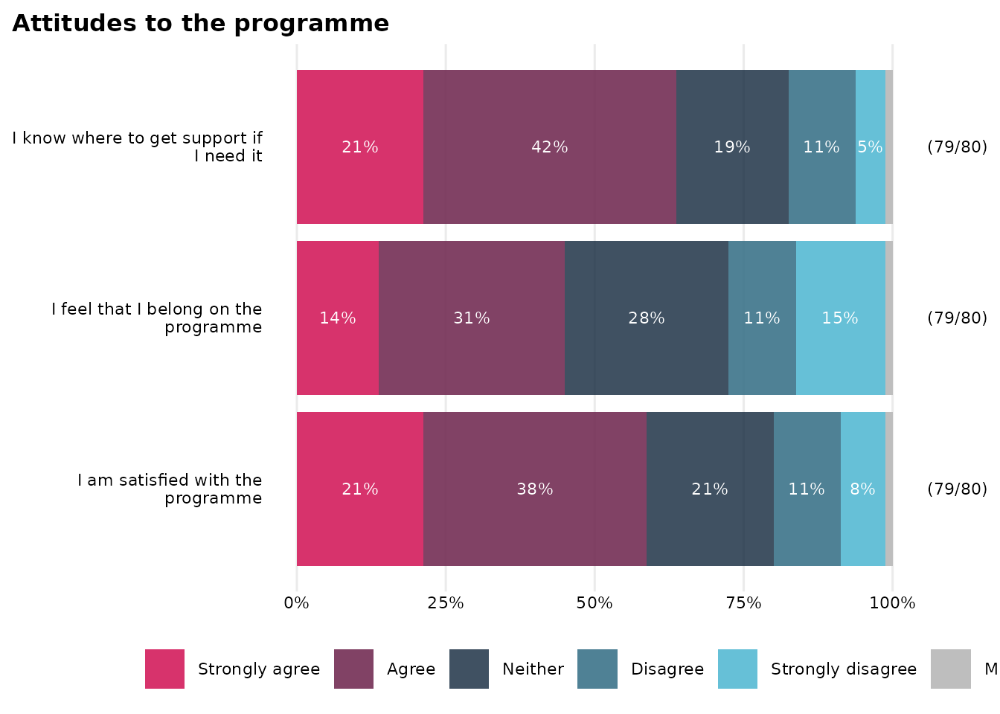
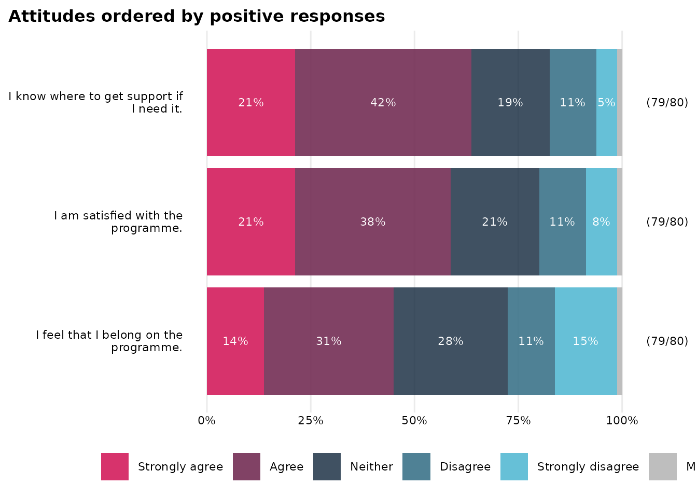
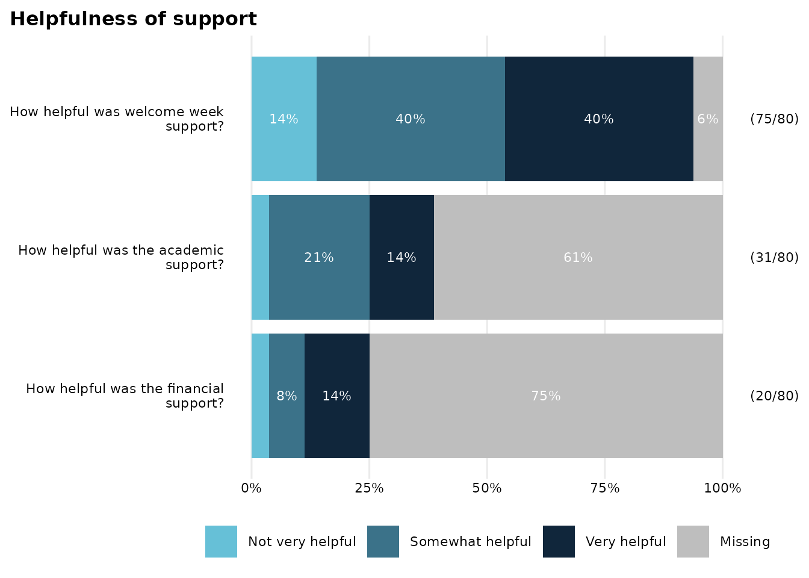
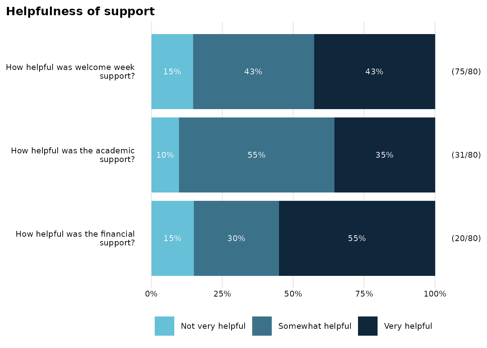

# dave_plotting_functions

First load the `OMESurvey` package and a couple of other packages (nice,
inoffensive ones hopefully) that are useful.

``` r

library(OMESurvey)
library(tibble)
library(dplyr)
#> 
#> Attaching package: 'dplyr'
#> The following objects are masked from 'package:stats':
#> 
#>     filter, lag
#> The following objects are masked from 'package:base':
#> 
#>     intersect, setdiff, setequal, union
```

First create some dummy survey data and a corresponding data dictionary
to use in the vignette. The data contains the following variables:

- `respondent_id`: a unique respondent identifier (included in the raw
  data but deliberately omitted from the dictionary to demonstrate
  handling of extra variables).
- `StartDate`: a survey start date (also omitted from the dictionary so
  that extra_vars behaviour can be illustrated).
- `school_type`: a categorical grouping variable with values Type A and
  Type B.
- `gender`: a second categorical grouping variable (included to
  demonstrate grouped summaries and plots).
- `q_satisfaction`, `q_belonging`, and `q_support`: three Likert-style
  attitude questions with the same response scale (to demonstrate
  categorical summaries and
  [`summary_plot_stacked_bar()`](https://jake-powell.github.io/OMESurvey/reference/summary_plot_stacked_bar.md)).
- `study_hours`: a numeric survey response giving estimated weekly study
  hours.
- `wellbeing_score` and `confidence_score`: numeric score variables on a
  0–10 scale (used to demonstrate
  [`OME_boxplot()`](https://jake-powell.github.io/OMESurvey/reference/OME_boxplot_.md)
  and
  [`summary_plot_boxplot()`](https://jake-powell.github.io/OMESurvey/reference/summary_plot_boxplot.md)).
- `q_used_support`: a yes/no branching variable indicating whether the
  respondent used support services.
- `q_extra_support`: a conditional follow-up question, only relevant
  where `q_used_support == "Yes"`.
- `q_other_comments`: a free-text response variable (used to demonstrate
  how text fields are handled in the report).

The dummy data also includes a small number of sentinel or deliberately
problematic values, such as -999, -888, -777, an out-of-range numeric
value, and a non-allowed categorical response. These are included so
that the validation and diagnostic parts of the report have something
meaningful to show and the examples of plotting functions can show their
capabilities.

## Preview the example inputs

Before rendering a report or preparing the data, it is useful to inspect
both the raw survey data and the dictionary.

Preparing the data and dictionary is part of pre-processing, so this
should need doing once only. Guidance on doing that is in the
Preprocessing SOP (which, at time of writing, is the Word document
`20260408_SOP_Pre-processing` in the/a folder of SOPs). This includes
information about constructing the data dictionary and what the
-999/-888/-777 missing codes mean / are used for.

## Save example inputs to temporary files

For the purposes of the vignette, we save the dummy data as a CSV file
and the corresponding dictionary as an Excel workbook. The dictionary is
written to a sheet called “example_survey”, which is the sheet name we
will pass to
[`render_survey_summary()`](https://jake-powell.github.io/OMESurvey/reference/render_survey_summary.md)
and
[`survey_prepare_data()`](https://jake-powell.github.io/OMESurvey/reference/survey_prepare_data.md)
below.

    #> [1] "/tmp/RtmpkbcSen/example_data_1c7e2d0d9b2b.csv"
    #> [1] "/tmp/RtmpkbcSen/example_survey_dictionary_1c7e4b3947dc.xlsx"

## Render the automated summary report

One can now use
[`render_survey_summary()`](https://jake-powell.github.io/OMESurvey/reference/render_survey_summary.md)
to create an HTML summary report from the dummy survey data and
dictionary, using code along the lines of the following. This isn’t done
here as it’s tricky and not the main point of the document.

``` r
render_survey_summary(
  data_path = <path to data file>,
  dict_path = <path to dictionary file>,
  dict_sheet = "example_survey",
  output_file = <filename for output file, e.g. 'year_X_summary.html'>,
  output_dir = <path to folder for output file>,
  output_title = "Year X pupil survey summary",
  output_author = "A Nonymous"
)
```

The returned value of this function is the path to the generated HTML
file. Open it in a browser to view the automated report.

## Prepare the data for further analysis

The report function prepares the data internally, but it is often useful
to prepare the data directly for further analysis and plotting. Here we
use
[`survey_prepare_data()`](https://jake-powell.github.io/OMESurvey/reference/survey_prepare_data.md)
to read the same CSV data and Excel dictionary, validate/coerce the
dictionary-backed variables, and return a prepared data frame.

We use `extra_vars = "suffix_asis"` so that variables present in the raw
data but absent from the dictionary, such as `respondent_id` and
`StartDate`, are retained with an `_asis` suffix.

``` r

prep <- survey_prepare_data(
  data_path = data_path,
  dict_path = dict_path,
  dict_sheet = "example_survey",
  extra_vars = "suffix_asis"
)

survey_data <- prep$data
validation_df <- prep$validation_df
```

We can take a quick look at the prepared data; noting particularly the
names of the variables: those in the dictionary have the raw
character-based version of the variable with the `_raw` suffix and the
original variable name containing the tidied-and-coerced-to-type
variable, and those not mentioned in the dictionary are appended with
`_asis` (in accordance with the `extra_vars` option).

``` r

dplyr::glimpse(survey_data)
#> Rows: 80
#> Columns: 30
#> $ respondent_id_asis             <chr> "R001", "R002", "R003", "R004", "R005",…
#> $ StartDate_asis                 <date> 2026-01-31, 2026-01-15, 2026-01-19, 20…
#> $ school_type                    <fct> Type B, Type B, Type B, Type A, Type A,…
#> $ gender                         <fct> Male, Male, Female, Female, Male, Male,…
#> $ q_satisfaction                 <fct> Neither, Agree, Neither, Strongly agree…
#> $ q_belonging                    <fct> Strongly agree, Agree, Agree, Strongly …
#> $ q_support                      <fct> Strongly agree, Strongly agree, NA, Nei…
#> $ study_hours                    <dbl> 14.4, 6.0, 14.3, 45.0, 4.6, 14.6, 24.3,…
#> $ wellbeing_score                <dbl> 0, 2, 3, 0, 4, 10, 3, NA, 6, 2, 9, 2, 1…
#> $ confidence_score               <dbl> 5, 8, 7, 0, 5, 1, 7, 9, 7, 8, 7, NA, 8,…
#> $ q_finance_support_used         <fct> No, No, No, No, No, Yes, No, Yes, No, N…
#> $ q_finance_support_helpful      <fct> NA, NA, NA, NA, NA, Somewhat helpful, N…
#> $ q_academic_support_used        <fct> No, No, No, Yes, No, Yes, No, No, Yes, …
#> $ q_academic_support_helpful     <fct> NA, NA, NA, Very helpful, NA, Somewhat …
#> $ q_welcome_support_helpful      <fct> Somewhat helpful, Very helpful, Somewha…
#> $ q_other_comments               <chr> "-999", "-999", "More advance notice wo…
#> $ school_type_raw                <chr> "Type B", "Type B", "Type B", "Type A",…
#> $ gender_raw                     <chr> "Male", "Male", "Female", "Female", "Ma…
#> $ q_satisfaction_raw             <chr> "Neither", "Agree", "Neither", "Strongl…
#> $ q_belonging_raw                <chr> "Strongly agree", "Agree", "Agree", "St…
#> $ q_support_raw                  <chr> "Strongly agree", "Strongly agree", "No…
#> $ study_hours_raw                <chr> "14.4", "6", "14.3", "45", "4.6", "14.6…
#> $ wellbeing_score_raw            <chr> "0", "2", "3", "0", "4", "10", "3", "-9…
#> $ confidence_score_raw           <chr> "5", "8", "7", "0", "5", "1", "7", "9",…
#> $ q_finance_support_used_raw     <chr> "No", "No", "No", "No", "No", "Yes", "N…
#> $ q_finance_support_helpful_raw  <chr> "-888", "-888", "-888", "-888", "-888",…
#> $ q_academic_support_used_raw    <chr> "No", "No", "No", "Yes", "No", "Yes", "…
#> $ q_academic_support_helpful_raw <chr> "-888", "-888", "-888", "Very helpful",…
#> $ q_welcome_support_helpful_raw  <chr> "Somewhat helpful", "Very helpful", "So…
#> $ q_other_comments_raw           <chr> "-999", "-999", "More advance notice wo…
```

If `reactable` is available, we can preview the prepared data
interactively.

The validation output summarises the checks carried out for each
dictionary-backed variable.

## Single-question categorical plot with `OME_stacked_bar()`

[`OME_stacked_bar()`](https://jake-powell.github.io/OMESurvey/reference/OME_stacked_bar_.md)
is useful for plotting one categorical survey response, optionally
broken down by a grouping variable. Here we show satisfaction by school
type

``` r

OME_stacked_bar(
  dat = survey_data,
  response_var = q_satisfaction,
  group_var = school_type,
  count_style = "both",
  titleText = "Satisfaction by year group"
)
```



The default fill colours for the bars are designed to be as distinct as
possible (the ‘distinct’ or ‘qualitative’ type of palette from
[`OMESurvey::get_OME_colours()`](https://jake-powell.github.io/OMESurvey/reference/get_OME_colours.md)).
This could be modified manually by passing
`OMESurvey::get_OME_colours(n=5, type='divergent')` as the `colo`
argument of the plotting function; but the validation output has that
set up and ready to be passed along:

``` r

validation_df |> filter(variable=="q_satisfaction") |> pull(colo) |> unlist()
#> Strongly disagree          Disagree           Neither             Agree 
#>       "#66C0D7FF"       "#3B7389E5"       "#10263BCC"       "#732C53E5" 
#>    Strongly agree 
#>       "#D7336CFF"
```

Passing this to
[`OME_stacked_bar()`](https://jake-powell.github.io/OMESurvey/reference/OME_stacked_bar_.md)
we get

``` r

OME_stacked_bar(
  dat = survey_data,
  response_var = q_satisfaction,
  group_var = school_type,
  colo = validation_df |> filter(variable=="q_satisfaction") |> pull(colo) |> unlist(),
  count_style = "both",
  titleText = "Satisfaction by year group"
)
```



This is a common recurring theme for factors and stacked bar charts: you
need to tell the plotting function what colour palette to use, but the
appropriate one is always available through the validation data frame:

``` r

validation_df |> filter(variable=="appropriate_variable_name") |> pull(colo) |> unlist()
```

(This method is preferable to passing OMESurvey::get_OME_colours(n=5,
type=‘divergent’) to the plotting function’s colo argument because it
also uses a named vector, which makes the matchup of levels and colours
a little less likely to go wrong in some unlikely-but-possible edge-case
scanarios.)

We can use the same method to lookat another Likert-scale type question,
here grouped by a different variable.

``` r

OME_stacked_bar(
  dat = survey_data,
  response_var = q_support,
  group_var = gender,
  colo = validation_df |> filter(variable=="q_support") |> pull(colo) |> unlist(),
  count_style = "both",
  titleText = "Knowing where to get support, by gender"
)
```



## Multi-question categorical plot with `summary_plot_stacked_bar()`

[`summary_plot_stacked_bar()`](https://jake-powell.github.io/OMESurvey/reference/summary_plot_stacked_bar.md)
summarises several categorical questions in one horizontal stacked bar
chart. The variables representing the questions must share the same
response scale. Here the three attitude questions all use the same
Likert scale.

``` r

attitude_labels <- c(
  q_satisfaction = "I am satisfied with the programme",
  q_belonging = "I feel that I belong on the programme",
  q_support = "I know where to get support if I need it"
)

survey_data |>
  dplyr::select(q_satisfaction, q_belonging, q_support) |>
  summary_plot_stacked_bar(
    colo = validation_df |> filter(variable=="q_satisfaction") |> pull(colo) |> unlist(),
    labels_vec = attitude_labels,
    count_style = "both",
    titleText = "Attitudes to the programme"
  )
```



A couple of things to note here:

- The vector of colours for `colo` is simply taken from one of the
  questions. (I could have something fancier, but it would have been
  hard.)
- We need to select() the variables to use in the data frame and then
  pass that to the plotting function. The function treats every variable
  in the dataframe it receives as a question to be plotted, hence the
  need to select() them first. Or, of course, use a base R equivalent:
  `survey_data[,c("q_satisfaction", "q_belonging", "q_support")] |> summary_plot_stacked_bar(...)`.

The questions can also be ordered according to a response pattern using
the `order_values` option. For example, we can order by the proportion
of respondents answering `"Agree"` or `"Strongly agree"`. In this
example we also show how to extract some more details (the question
labels as well as the colour palette) from the `validation_df` rather
than hard-coding them.

``` r

attitude_vars <- c("q_satisfaction", "q_belonging", "q_support")

# find labels that match vars
attitude_labels <- validation_df |>
  dplyr::filter(variable %in% attitude_vars) |>
  dplyr::arrange(match(variable, attitude_vars)) |>
  dplyr::pull(item_statement) |>
  stats::setNames(attitude_vars)

# find colour palette
attitude_colo <- validation_df |>
  dplyr::filter(variable == attitude_vars[1]) |>
  dplyr::pull(colo) |>
  unlist()

# plot
survey_data |>
  dplyr::select(dplyr::all_of(attitude_vars)) |>
  summary_plot_stacked_bar(
    colo = attitude_colo,
    labels_vec = attitude_labels,
    count_style = "both",
    order_values = c("Agree", "Strongly agree"),
    titleText = "Attitudes ordered by positive responses"
  )
```



### Dealing with survey routing

The three helpfulness questions use the same response scale, but they do
not all have the same denominator. Financial-support helpfulness is only
relevant to respondents who used financial support, academic-support
helpfulness is only relevant to respondents who used academic support,
while welcome-week helpfulness is asked of everyone. Just plotting these
variables is a bit misleading as we do not respect the
conditions/routing.

``` r

survey_data |>
  janitor::tabyl(q_finance_support_helpful, q_finance_support_used) |>
  janitor::adorn_title() |>
  kable_narrow()
```

|                           | q_finance_support_used |     |      |
|:--------------------------|:-----------------------|:----|:-----|
| q_finance_support_helpful | Yes                    | No  | NA\_ |
| Very helpful              | 11                     | 0   | 0    |
| Somewhat helpful          | 6                      | 0   | 0    |
| Not very helpful          | 3                      | 0   | 0    |
| NA                        | 5                      | 54  | 1    |

``` r

helpful_vars <- c(
  "q_finance_support_helpful",
  "q_academic_support_helpful",
  "q_welcome_support_helpful"
)

# Get labels and colours from validation_df
helpful_labels <-
  validation_df |>
  dplyr::filter(variable %in% helpful_vars) |>
  dplyr::arrange(match(variable, helpful_vars)) |>
  dplyr::pull(item_statement) |>
  stats::setNames(helpful_vars)

helpful_colo <-
  validation_df |>
  dplyr::filter(variable == helpful_vars[1]) |>
  dplyr::pull(colo) |>
  (\(x) x[[1]])()

# plot
survey_data |>
  dplyr::select(dplyr::all_of(helpful_vars)) |>
  summary_plot_stacked_bar(
    labels_vec = helpful_labels,
    colo = helpful_colo,
    count_style = "both",
    titleText = "Helpfulness of support",
  )
```



Simply removing missing values with the `na.rm=TRUE` option gives a
nicer-looking plot but misses the point somewhat: most missing /
non-allowed values are because of routing, but several are not.

``` r

survey_data |>
  dplyr::select(dplyr::all_of(helpful_vars)) |>
  summary_plot_stacked_bar(
    labels_vec = helpful_labels,
    colo = helpful_colo,
    na.rm = TRUE,
    count_style = "both",
    titleText = "Helpfulness of support"
  )
```



The plot is an improvement, but does not properly capture the 20
substantive responses, 5 missing/invalid responses, 55 non-routed
non-responses.

The
[`summary_plot_stacked_bar()`](https://jake-powell.github.io/OMESurvey/reference/summary_plot_stacked_bar.md)
function supports an “extended” data format to deal with this, where
each plotted variable has a name ending `_value` and companion variables
ending `_include`, and `_plot`:

- `*_value`: the response value to plot;
- `*_include`: whether the respondent should be included in that
  question’s denominator;
- `*_plot`: whether the response is a valid substantive value to show.

You can construct these these `_value`, `_include`, `_plot` variables
yourself if you like, but there’s a function
[`make_extended_summary_plot_data()`](https://jake-powell.github.io/OMESurvey/reference/make_extended_summary_plot_data.md)
to do so automatically. Provide it with the data, the validation
information and the variables you want to work with and it gives you a
dataframe ready for passing to
[`summary_plot_stacked_bar()`](https://jake-powell.github.io/OMESurvey/reference/summary_plot_stacked_bar.md).

Here’s how we can set this up for these helpfulness questions.

``` r

# set up variables to work with
helpful_vars <- c(
  "q_finance_support_helpful",
  "q_academic_support_helpful",
  "q_welcome_support_helpful"
)

# build the extended data for plotting
helpful_ext <- make_extended_summary_plot_data(
  data = survey_data,
  validation_df = validation_df,
  vars = helpful_vars
)


#plot
helpful_ext |>
  summary_plot_stacked_bar(
    dat_format = "extended",
    labels_vec = helpful_labels,
    colo = helpful_colo,
    na.rm = TRUE,
    count_style = "both",
    titleText = "Helpfulness of support"
  )
```


Note especially the label “(20/25)” for the financial support question,
capturing the 20 substantive responses (and 5
missing/invalid/non-allowed responses) amongst the 25 respondents who
were routed to this question. And the same is true for the academic
support question. And the welcome week support question, which was asked
to everyone, still has the full number of respondents indicated,
reflecting it being asked to everyone and thus not having a condition in
the data dictionary.

``` r

knitr::knit_exit()
```
