# Dave's plotting (and other) functions

Readers who just want to see how the plotting functions work should have
a quick look at Section 1.2 to get some sense of the example/dummy data
used in this vignette and then skip to Section 4 or later.

This vignette aims to show the main functionality of the functions that
I (Dave) have developed around survey data summaries - doing those
summaries, using the data and dictionary from those summaries to prepare
survey data for further analysis/exploration, making plots in the same
style (and, coming later, making other kinds of plots using the same
theme and/or colour palettes).

## Setup

### Packages for this vignette

Load the `OMESurvey` package and a couple of other packages
(inoffensive, commonly-used ones hopefully) that will be useful.

``` r

library(OMESurvey)
library(tibble)
library(dplyr)
library(ggplot2)
```

### Some dummy data

Now create some dummy survey data and a corresponding data dictionary to
use in the vignette. The data contains the following variables,
corresponding to an imagined survey that has hastily-thought-of
questions that probably don’t overall fit together all that well:

- `respondent_id`: a unique respondent identifier (included in the raw
  data but deliberately omitted from the dictionary to demonstrate
  handling of extra variables).
- `StartDate`: a survey start date (also omitted from the dictionary so
  that extra_vars behaviour can be illustrated).
- `school_type`: a categorical grouping variable with values Type A and
  Type B.
- `gender`: a second categorical grouping variable.
- `q_satisfaction`, `q_belonging`, and `q_support`: three Likert-style
  attitude questions with the same response scale (to demonstrate
  categorical summaries and
  [`summary_plot_stacked_bar()`](https://jake-powell.github.io/OMESurvey/reference/summary_plot_stacked_bar.md)).
- `study_hours`: a numeric survey response giving estimated weekly study
  hours.
- `wellbeing_score` and `confidence_score`: numeric score variables on a
  0–10 scale (used to demonstrate
  [`OME_boxplot()`](https://jake-powell.github.io/OMESurvey/reference/OME_boxplot_.md)
  and
  [`summary_plot_boxplot()`](https://jake-powell.github.io/OMESurvey/reference/summary_plot_boxplot.md)).
- `q_welcome_support_helpful`: A Likert-style question about whether
  they found welcome week support helpful.
- `q_finance_support_used`, `q_finance_support_helpful`: a yes/no
  branching variable indicating whether the respondent used finance
  support services and, for those who answered Yes, a Likert style
  question about whether they found it helpful.
- `q_academic_support_used`, `q_academic_support_helpful`: as above for
  academic support.
- `q_other_comments`: a free-text response variable (used to demonstrate
  how text fields are handled in the report).

The dummy data has been set up to

- use the -888 missing-due-to-branching code as should be the case for
  real OME survey data,
- include some -999 missing values,
- include a few -777 invalid values, an out-of-range numeric value, and
  a non-allowed categorical response.

These are included so that the validation and diagnostic parts of the
report have something meaningful to show and the examples of plotting
functions can show their capabilities.

### Preview the example inputs

Before rendering a report or preparing the data, it is useful to briefly
inspect both the raw survey data and the dictionary.

Preparing the data and dictionary is part of pre-processing, so this
should need doing once only and is something that readers of this
document will not have to worry much about. Guidance on doing that is in
the Preprocessing SOP (which, at time of writing, is the Word document
`20260408_SOP_Pre-processing` in the/a folder of SOPs). An exception to
this might be if you are doing a detailed data analysis (say, for a
paper) and want to make a copy of the data dictionary to edit so that
you can tweak the data preparation in a way that’s useful for your
analysis (rather than in a way that’s useful for summarising the whole
survey, which is the intention of the main data dictionary).

**Data**

**Data dictionary**

### Save example inputs to temporary files

For the purposes of the vignette, we save the dummy data as a CSV file
and the corresponding dictionary as an Excel workbook. The dictionary is
written to a sheet called “example_survey”, which is the sheet name we
will pass to
[`render_survey_summary()`](https://jake-powell.github.io/OMESurvey/reference/render_survey_summary.md)
and
[`survey_prepare_data()`](https://jake-powell.github.io/OMESurvey/reference/survey_prepare_data.md)
below.

    #> [1] "/tmp/RtmpM02F2T/example_data_1d224b2bf321.csv"
    #> [1] "/tmp/RtmpM02F2T/example_survey_dictionary_1d22a06ff29.xlsx"

## Automated summary report

One can now use
[`render_survey_summary()`](https://jake-powell.github.io/OMESurvey/reference/render_survey_summary.md)
to create an HTML summary report from the dummy survey data and
dictionary, using code along the lines of the following. This isn’t done
here as it’s tricky to implement in a vignette and it’s not the main
point of this document. (There’s more info in the pre-processing SOP.)

``` r
render_survey_summary(
  data_path = <path to data file>,
  dict_path = <path to dictionary file>,
  dict_sheet = "example_survey",
  output_file = <filename for output file, e.g. 'year_X_summary.html'>,
  output_dir = <path to folder for output file>,
  output_title = "Year X pupil survey summary",
  output_author = "A Nonymous"
)
```

## Prepare the data for further analysis

The report function first prepares the data internally (turning a
csv/xlsx data file into a better-structured R data frame, e.g. ensuring
that factors have the right levels) and then uses that data frame (and
other validation information based on the data and data dictionary) to
build the report. But it seems likely to be useful to have the data
preparation phase separated, for further analysis and plotting.

The function
[`survey_prepare_data()`](https://jake-powell.github.io/OMESurvey/reference/survey_prepare_data.md)
can be used to read the same csv/Excel data and Excel data dictionary,
then validate/coerce the dictionary-backed variables to the appropriate
numeric/factor types. The function returns a list containing several
objects: most important for our purposes are the data (`data`) and a
data frame that contains lots of validation information
(`validation_df`). (There are also lists of messages that arose during
the data & dictionary reading and processing, a list version of the
validation information and other objects concerning the treatment of
variables in the source data but not in the dictionary.)

``` r

prep <- survey_prepare_data(
  data_path = data_path,
  dict_path = dict_path,
  dict_sheet = "example_survey"
)

survey_data <- prep$data
validation_df <- prep$validation_df
```

In order to further customise the data this produces, one can make and
edit a copy of the data dictionary. This allows full control over which
variables are/aren’t included, which values are treated as
allowed/valid, etc. (One can also have establishment characteristics
data merged into the survey data - see the SOP for info on how to do
that, for now at least.)

We can take a quick look at the prepared data, noting particularly the
names of the variables:

- variables that are in the dictionary **and** have an assigned section
  (i.e. a non-blank entry in `report_sec`) have the raw character-based
  version of the variable with the `_raw` suffix and the original
  variable name containing the tidied-and-coerced-to-type variable,
- variables without both an entry in the dictionary and a non-blank
  `report_sec` are appended with `_asis` (emphasising that they’ve not
  be processed in any way, in accordance with the default for the
  `extra_vars` option for
  [`survey_prepare_data()`](https://jake-powell.github.io/OMESurvey/reference/survey_prepare_data.md)).

The validation output summarises the checks carried out for each
dictionary-backed variable. (Here we show only some of the key columns
in the `validation_df` output.)

## Categorical variables: stacked bar charts

### Single-question categorical plot with `OME_stacked_bar()`

[`OME_stacked_bar()`](https://jake-powell.github.io/OMESurvey/reference/OME_stacked_bar_.md)
is used for plotting one categorical survey response, optionally broken
down by a grouping variable. Here we show satisfaction by school type

``` r

OME_stacked_bar(
  dat = survey_data,
  response_var = q_satisfaction,
  group_var = school_type,
  count_style = "both",
  titleText = "Satisfaction by year group"
)
```

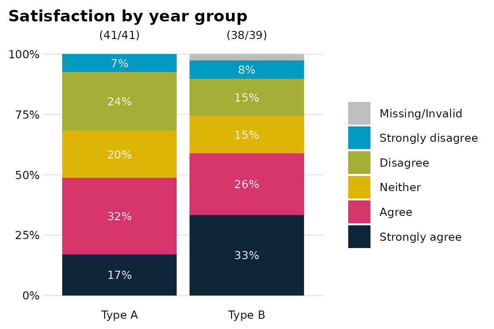

The default fill colours for the bars are (the ‘distinct’ or
‘qualitative’ palette type from
[`OMESurvey::get_OME_colours()`](https://jake-powell.github.io/OMESurvey/reference/get_OME_colours.md)),
designed to be as distinct/easy-to-distinguish as possible. This palette
can be modified manually by passing, for example,
`OMESurvey::get_OME_colours(n=5, type='divergent')` as the `colo`
argument of the plotting function. But the validation output already has
that set up (from the info in the data dictionary) and ready to use:

``` r

validation_df |> filter(variable=="q_satisfaction") |> pull(colo) |> (\(x) x[[1]])()
#> Strongly disagree          Disagree           Neither             Agree 
#>       "#66C0D7FF"       "#3B7389E5"       "#10263BCC"       "#732C53E5" 
#>    Strongly agree 
#>       "#D7336CFF"
```

(Aside: the `(\(x) x[[1]])()` at the end of the code extracts the first
item from a list - it is needed because of how the validation info is
stored, which in turn is needed to avoid some technical issues that
result from what R tries to do when you include a vector as an element
of a vector. The colo variable in validation_df is a list-column, with
entries either NA or a vector describing the palette.)

Passing this to
[`OME_stacked_bar()`](https://jake-powell.github.io/OMESurvey/reference/OME_stacked_bar_.md)
we get

``` r

OME_stacked_bar(
  dat = survey_data,
  response_var = q_satisfaction,
  group_var = school_type,
  colo = validation_df |> filter(variable=="q_satisfaction") |> pull(colo) |> (\(x) x[[1]])(),
  count_style = "both",
  titleText = "Satisfaction by year group"
)
```

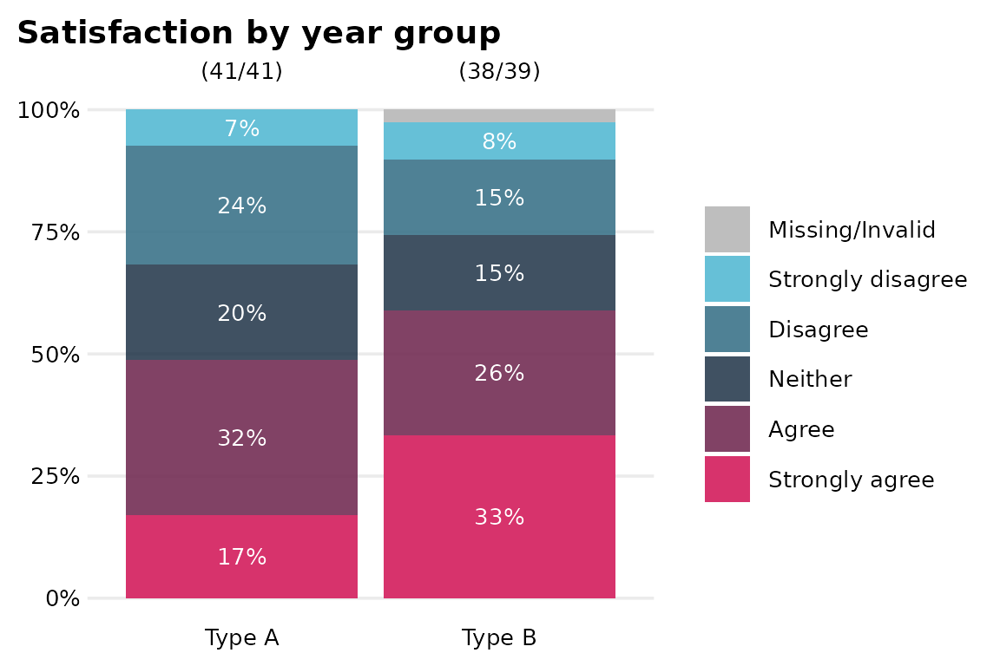

This is a common recurring theme for factors and stacked bar charts: you
need to tell the plotting function what colour palette to use, but the
appropriate one is always available through the validation data frame:

``` r

validation_df |> filter(variable=="appropriate_variable_name") |> pull(colo) |> (\(x) x[[1]])()
```

(This method is preferable to passing
`OMESurvey::get_OME_colours(n=5, type='divergent')` to the plotting
function’s `colo` argument because it returns a named vector, which
makes the matching of levels and colours less likely to go wrong in some
unlikely-but-realistic edge-case scenarios.)

We can use the same method to look at the distribution of responses to
another Likert-scale type question, here (i) grouped by a different
variable and (ii) with missing/invalid values excluded from the stacked
bars (but still indicated in the numbers in parentheses).

``` r

OME_stacked_bar(
  dat = survey_data,
  response_var = q_support,
  group_var = gender,
  na.rm = TRUE,
  colo = validation_df |> filter(variable=="q_support") |> pull(colo) |> (\(x) x[[1]])(),
  count_style = "both",
  titleText = "Knowing where to get support, by gender"
)
```

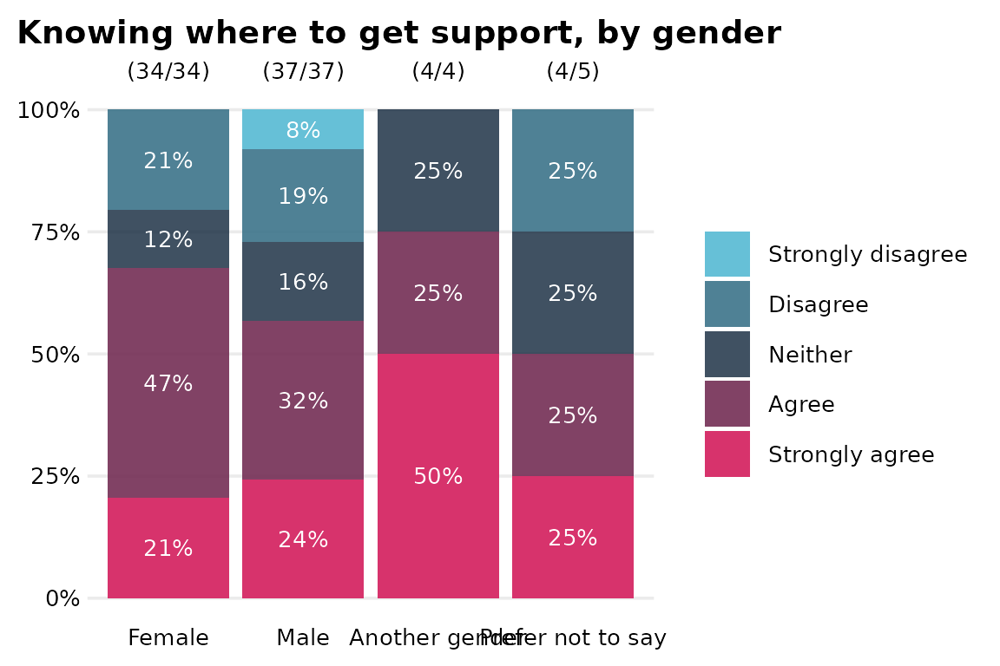

#### An example with routing taken account of

It is fairly simple to deal with routing here directly: filter the data
appropriately before passing it to the plotting function.

``` r

survey_data |>
  filter(q_finance_support_used == "Yes") |>
  OME_stacked_bar(
    response_var = q_finance_support_helpful,
    colo = validation_df |>
      filter(variable == "q_finance_support_helpful") |>
      pull(colo) |>
      (\(x) x[[1]])(),
    na.rm = TRUE,
    count_style = "both",
    titleText = "Helpfulness of financial support"
  )
```

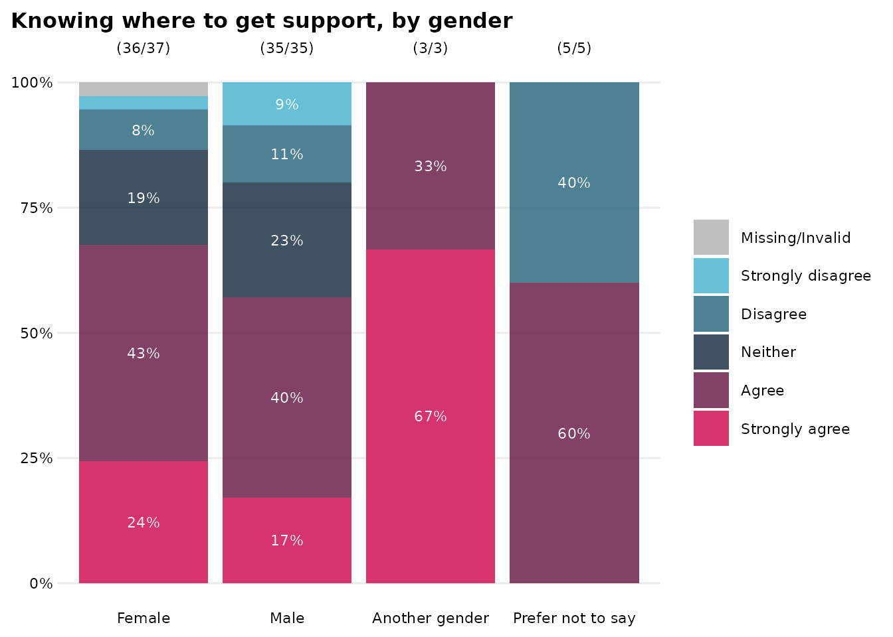

(It’s possible to do this in a slightly more programmatic way, using
information about routing from `validation_df`, but for now I’m leaving
that out.)

### Multi-question categorical plot with `summary_plot_stacked_bar()`

[`summary_plot_stacked_bar()`](https://jake-powell.github.io/OMESurvey/reference/summary_plot_stacked_bar.md)
summarises several categorical questions in one horizontal stacked bar
chart. The variables representing the questions must share the same
response scale, like the three attitude questions in the dummy data, for
example.

(In principle one could `pivot_longer()` the data for the relevant
variables manually and then use
[`OME_stacked_bar()`](https://jake-powell.github.io/OMESurvey/reference/OME_stacked_bar_.md)
as above. But (i) this is a common task and (ii) it gets tricky when
dealing with missing values and/or survey branching conditions. Hence
the specially-written function.)

``` r

attitude_vars <- c("q_satisfaction", "q_belonging", "q_support")

# extract labels that match vars
attitude_labels <- validation_df |>
  dplyr::filter(variable %in% attitude_vars) |>
  dplyr::arrange(match(variable, attitude_vars)) |>
  dplyr::pull(item_statement) |>
  stats::setNames(attitude_vars)

# extract colour palette
attitude_colo <- validation_df |>
  dplyr::filter(variable == attitude_vars[1]) |>
  dplyr::pull(colo) |>
  (\(x) x[[1]])()

survey_data |>
  dplyr::select(q_satisfaction, q_belonging, q_support) |>
  summary_plot_stacked_bar(
    colo = attitude_colo,
    labels_vec = attitude_labels,
    count_style = "both",
    titleText = "Attitudes to the programme"
  )
```

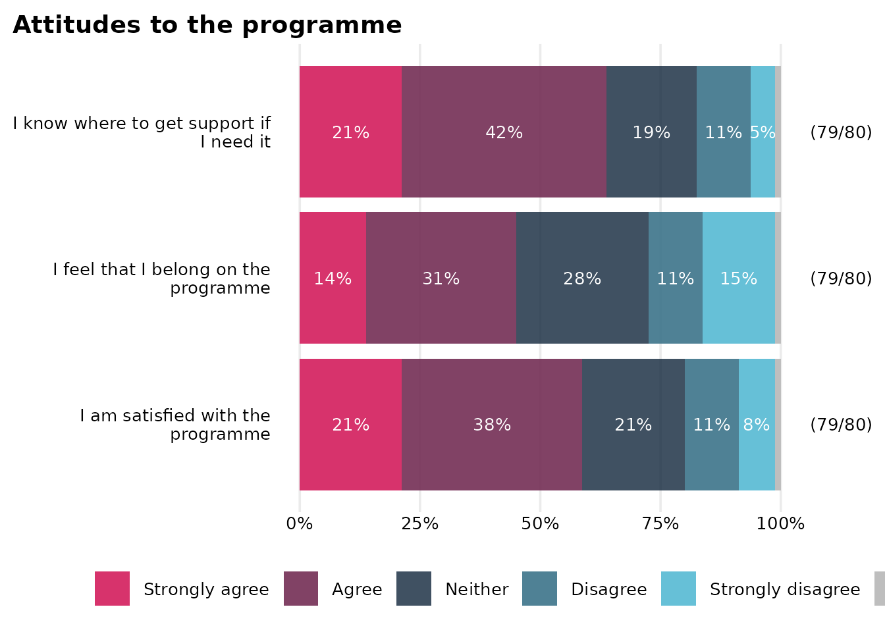

A couple of things to note here:

- The vector/palette of colours `attitude_colo` is simply taken from one
  of the questions. (I could have something fancier, but it would have
  been hard to code. You need to make sure that the variables you are
  using have the same allowed values / response options!)
- We need to
  [`select()`](https://dplyr.tidyverse.org/reference/select.html) the
  variables to use in the data frame and then pass that to the plotting
  function. The function treats every variable in the data frame it
  receives as a question to be plotted, hence the need to select() them
  first. Or, of course, use a base R equivalent:
  `survey_data[,c("q_satisfaction", "q_belonging", "q_support")] |> summary_plot_stacked_bar(...)`.

#### Ordering questions

The questions can also be ordered according to a response pattern using
the `order_values` option. For example, we can order by the proportion
of respondents answering `"Agree"` or `"Strongly agree"`. In this
example we also show how to extract some more details (the question
labels as well as the colour palette) from the `validation_df` rather
than hard-coding them.

``` r

attitude_vars <- c("q_satisfaction", "q_belonging", "q_support")

# extract labels that match vars
attitude_labels <- validation_df |>
  dplyr::filter(variable %in% attitude_vars) |>
  dplyr::arrange(match(variable, attitude_vars)) |>
  dplyr::pull(item_statement) |>
  stats::setNames(attitude_vars)

# extract colour palette
attitude_colo <- validation_df |>
  dplyr::filter(variable == attitude_vars[1]) |>
  dplyr::pull(colo) |>
  (\(x) x[[1]])() 

# plot
survey_data |>
  dplyr::select(dplyr::all_of(attitude_vars)) |>
  summary_plot_stacked_bar(
    colo = attitude_colo,
    labels_vec = attitude_labels,
    count_style = "both",
    order_values = c("Agree", "Strongly agree"),
    titleText = "Attitudes ordered by positive responses"
  )
```

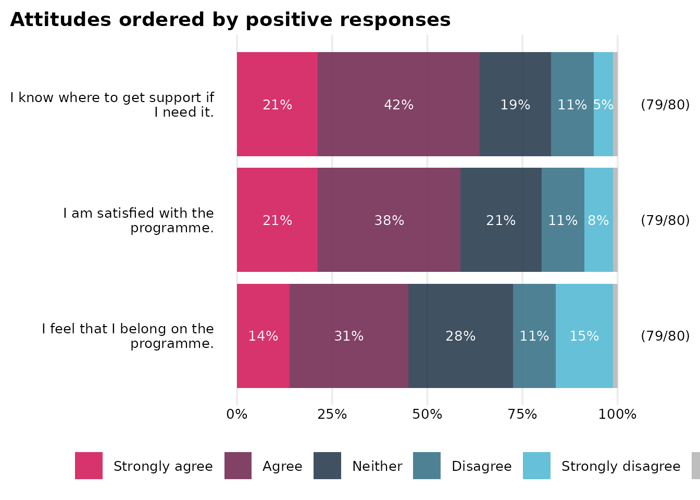

#### Dealing with survey routing

**It’s a bit awkward**

The three helpfulness questions use the same response scale, but we do
not have data for the same respondents across all the questions.
Financial-support helpfulness is only relevant to respondents who used
financial support, academic-support helpfulness is only relevant to
respondents who used academic support, while the welcome-week
helpfulness question is asked of everyone. Just plotting these variables
is misleading as we do not respect the routing of the survey (i.e. the
conditions in the data dictionary).

``` r

helpful_vars <- c(
  "q_finance_support_helpful",
  "q_academic_support_helpful",
  "q_welcome_support_helpful"
)

# Extract labels and colours from validation_df
helpful_labels <-
  validation_df |>
  dplyr::filter(variable %in% helpful_vars) |>
  dplyr::arrange(match(variable, helpful_vars)) |>
  dplyr::pull(item_statement) |>
  stats::setNames(helpful_vars)

helpful_colo <-
  validation_df |>
  dplyr::filter(variable == helpful_vars[1]) |>
  dplyr::pull(colo) |>
  (\(x) x[[1]])()

# plot
survey_data |>
  dplyr::select(dplyr::all_of(helpful_vars)) |>
  summary_plot_stacked_bar(
    labels_vec = helpful_labels,
    colo = helpful_colo,
    count_style = "both",
    titleText = "Helpfulness of support",
  )
```

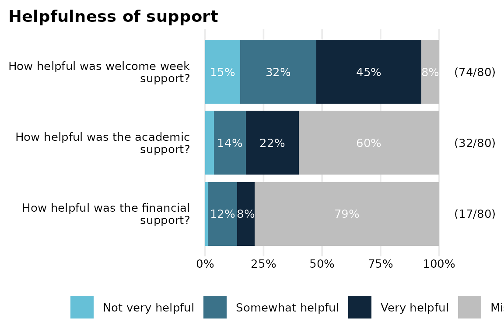

As the following table makes explicit, only 25 respondents were asked
about the helpfulness of financial support. And then, only 20 of them
gave a substantive response. The label “(20/80)” and the 75% missing
bar/label do not convey this at all.

``` r

survey_data |>
  janitor::tabyl(q_finance_support_helpful, q_finance_support_used) |>
  janitor::adorn_totals(where="both") |>
  janitor::adorn_title() |>
  kable_narrow()
```

|                           | q_finance_support_used |     |      |       |
|:--------------------------|:-----------------------|:----|:-----|:------|
| q_finance_support_helpful | Yes                    | No  | NA\_ | Total |
| Very helpful              | 6                      | 0   | 0    | 6     |
| Somewhat helpful          | 10                     | 0   | 0    | 10    |
| Not very helpful          | 1                      | 0   | 0    | 1     |
| NA                        | 1                      | 61  | 1    | 63    |
| Total                     | 18                     | 61  | 1    | 80    |

Simply removing missing values (using the `na.rm=TRUE` option) is an
improvement, and together with some explanation it might be good enough
for some purposes (especially if we tidy up the labels by using the
`count_style="non-missing"` argument or even omit them using
`show_counts=FALSE`). But it still doesn’t convey all the information
that we have. While most missing / non-allowed values are because of
routing, several are not; neither the labels nor the plot properly
capture that there are 20 substantive responses, 5 missing/invalid
responses, 55 non-routed non-responses.

**But there’s a way around it**

The
[`summary_plot_stacked_bar()`](https://jake-powell.github.io/OMESurvey/reference/summary_plot_stacked_bar.md)
function supports an “extended” data format to deal with this, where
each plotted variable has a name ending `_value` and companion variables
ending `_include`, and `_plot` which together capture the
substantive/missing/irrelevant structure:

- `*_value`: the response value to plot;
- `*_include`: whether the respondent should be included in the
  denominator of that question’s label;
- `*_plot`: whether the response is a valid substantive value to show
  (i.e. should be included in the plot and numerator of the label).

Of course it’s possible to construct these `*_value`, `*_include`,
`*_plot` variables yourself, using what you know about the routing
conditions for each variable. But it’s fiddly. So there’s a function
[`make_extended_summary_plot_data()`](https://jake-powell.github.io/OMESurvey/reference/make_extended_summary_plot_data.md)
to do it automatically, using the information from the data dictionary,
which is contained in the data/dictionary validation information (which
we’ve already used to get colour palettes & survey item labels). Provide
the function with the data and validation information from
[`survey_prepare_data()`](https://jake-powell.github.io/OMESurvey/reference/survey_prepare_data.md)
and the variables you want to work with and it gives you a dataframe
ready for passing to
[`summary_plot_stacked_bar()`](https://jake-powell.github.io/OMESurvey/reference/summary_plot_stacked_bar.md).

Here’s how we can use it for the helpfulness questions in our dummy
survey.

``` r

helpful_ext <- make_extended_summary_plot_data(
  data = survey_data,
  validation_df = validation_df,
  vars = helpful_vars
)
```

Then we can use the same
[`summary_plot_stacked_bar()`](https://jake-powell.github.io/OMESurvey/reference/summary_plot_stacked_bar.md)
function with this extended-format data.

``` r

helpful_ext |>
  summary_plot_stacked_bar(
    dat_format = "extended",
    labels_vec = helpful_labels,
    colo = helpful_colo,
    na.rm = TRUE,
    count_style = "both",
    titleText = "Helpfulness of support"
  )
```

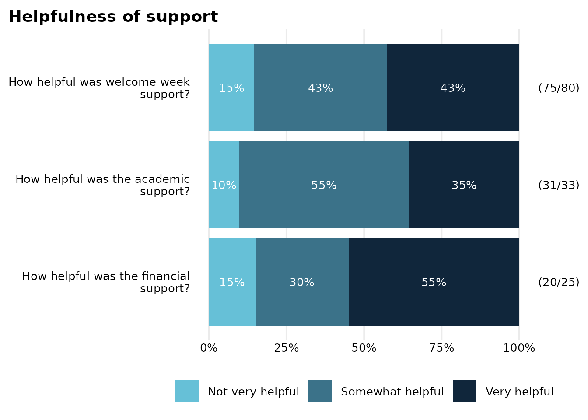

Note especially the label “(20/25)” for the financial support question,
capturing the 20 substantive responses (and 5
missing/invalid/non-allowed responses) amongst the 25 respondents who
were routed to this question. The same is true for the academic support
question, as could be verified by constructing a crosstab of the
`q_academic_support_used` and `q_academic_support_helpful` variables.
And the welcome week support question, which was asked to everyone,
still has the full number of respondents indicated (reflecting it being
asked to everyone and thus not having a condition in the data
dictionary).

**Including the missing/invalid responses**

If you do want to include the missing/invalid responses in the stacked
bars, you can do so by changing the `na.rm` option to `FALSE`. This will
ensure that the missing responses are included in the bars, but still
shows the number of valid responses and number of routed responses in
the annotation on the right (this can be varied using the `count_style`
option).

``` r

helpful_ext |>
  summary_plot_stacked_bar(
    dat_format = "extended",
    labels_vec = helpful_labels,
    colo = helpful_colo,
    na.rm = FALSE,
    count_style = "both",
    titleText = "Helpfulness of support"
  )
```

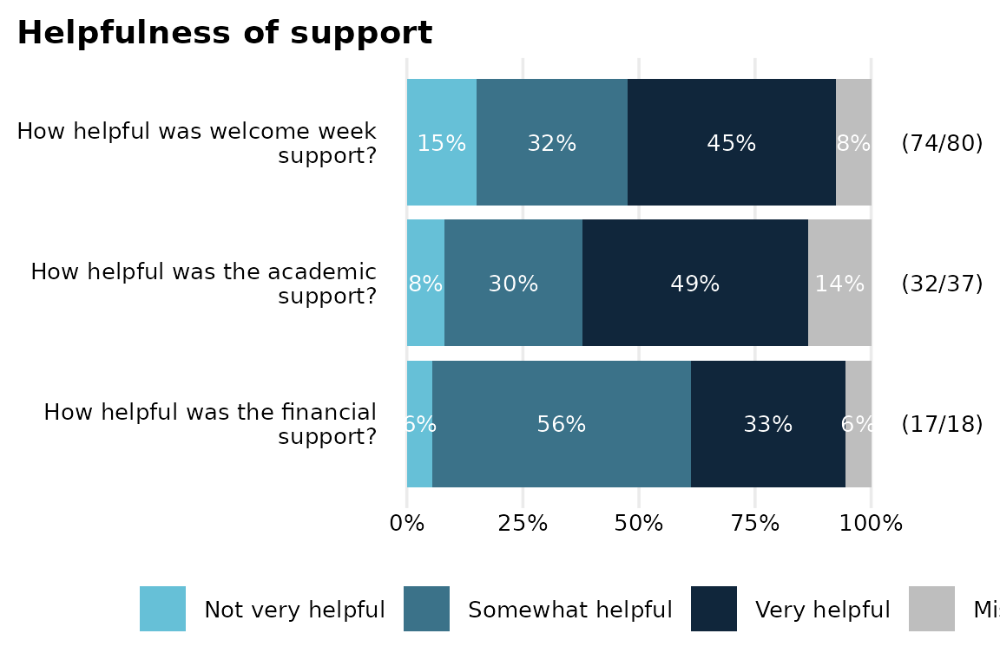

### Other tweaking for stacked bar charts

Unless otherwise stated, these methods are applicable to plots created
with both
[`OME_stacked_bar()`](https://jake-powell.github.io/OMESurvey/reference/OME_stacked_bar_.md)
and
[`summary_plot_stacked_bar()`](https://jake-powell.github.io/OMESurvey/reference/summary_plot_stacked_bar.md).

#### Font size

There is a `base_size` option that works for both
[`OME_stacked_bar()`](https://jake-powell.github.io/OMESurvey/reference/OME_stacked_bar_.md)
and
[`summary_plot_stacked_bar()`](https://jake-powell.github.io/OMESurvey/reference/summary_plot_stacked_bar.md).
The base size is given in points and is the size of the title text, with
axis/legend title text 0.85 times the base size and axis/legend label
text 0.7 times that size. The default 14 makes these sizes just under 12
and 11 points, respectively. But for a presentation one might want to
make all the text a bit bigger:

``` r

helpful_ext |>
  summary_plot_stacked_bar(
    dat_format = "extended",
    labels_vec = helpful_labels,
    colo = helpful_colo,
    base_size = 18
  )
```

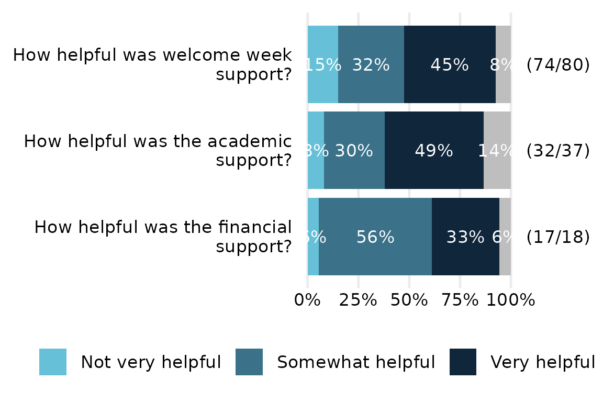

#### Label text wrapping

If labels are particularly long then changing the way they are wrapped
can be helpful to make the plot easier to read. This is more likely to
be an issue with larger text size too.

The `group_label_width` option is the target number of characters used
before breaking to a new line (with `NULL` meaning ‘no line breaks’).
The defaults are NULL for
[`OME_boxplot()`](https://jake-powell.github.io/OMESurvey/reference/OME_boxplot_.md)
and 30 for
[`summary_plot_boxplot()`](https://jake-powell.github.io/OMESurvey/reference/summary_plot_boxplot.md).
For example:

``` r

helpful_ext |>
  summary_plot_stacked_bar(
    dat_format = "extended",
    labels_vec = helpful_labels,
    colo = helpful_colo,
    group_label_width = 20
  )
```

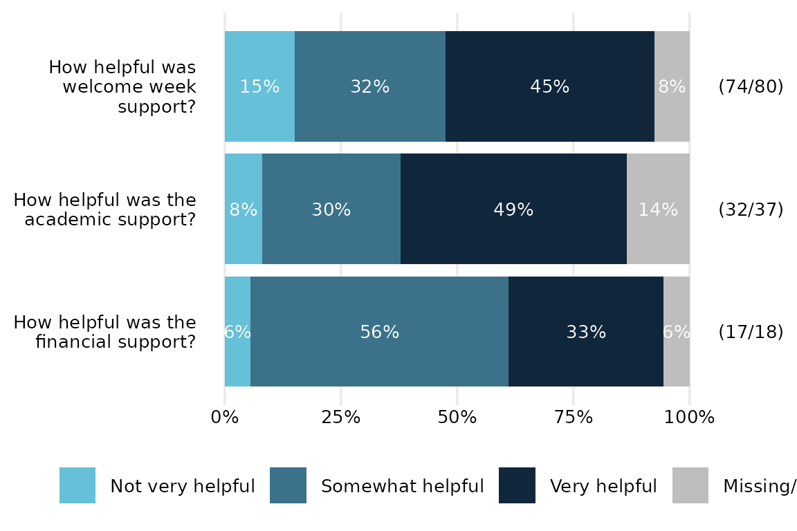

And `fill_label_width` does the same for the legend labels (with default
20).

``` r

helpful_ext |>
  summary_plot_stacked_bar(
    dat_format = "extended",
    labels_vec = helpful_labels,
    colo = helpful_colo,
    fill_label_width = 10
  )
```

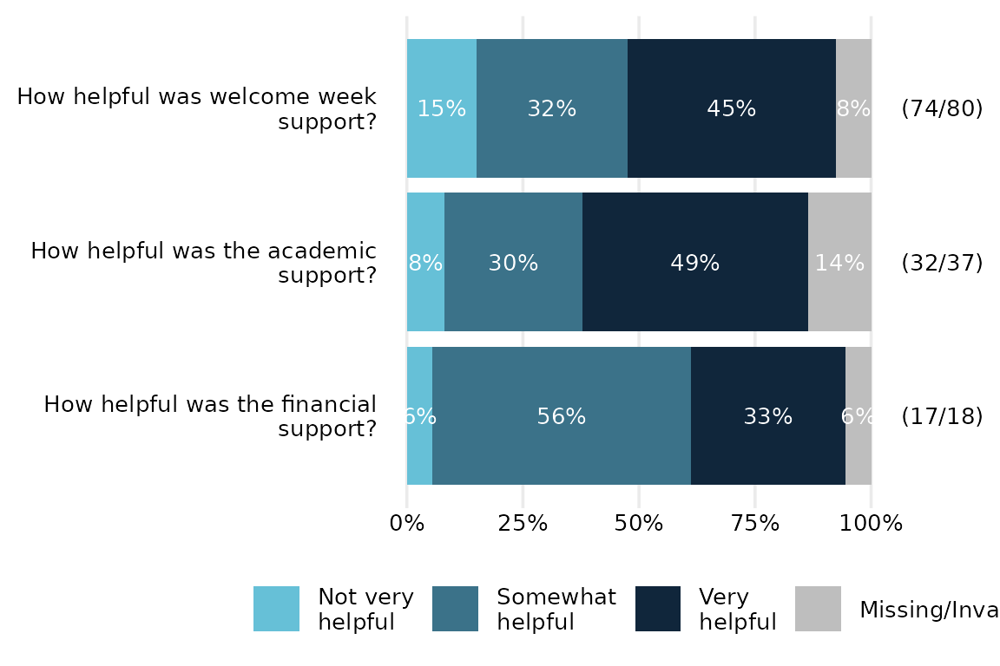

#### Legend positioning/alignment

There is another helpful trick available if the legend is below the plot
(i.e. spread out horizontally) and needs a bit more space: use the
`legend.location` option of the ggplot2 theme. The default is ‘panel’,
which aligns the legend with the plotting panel only, but the
alternative ‘plot’ aligns it with the whole area of the figure:

``` r

helpful_ext |>
  summary_plot_stacked_bar(
    dat_format = "extended",
    labels_vec = helpful_labels,
    colo = helpful_colo
    ) +
  theme(legend.location = 'plot')
```

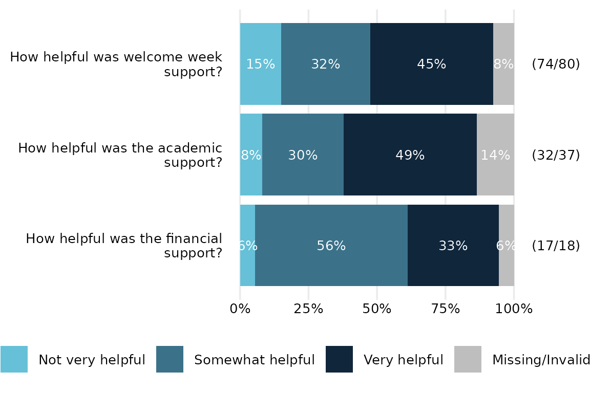

## Numerical variables: boxplots

### Single-question numeric plot with `OME_boxplot()`

[`OME_boxplot()`](https://jake-powell.github.io/OMESurvey/reference/OME_boxplot_.md)
is the numeric equivalent of
[`OME_stacked_bar()`](https://jake-powell.github.io/OMESurvey/reference/OME_stacked_bar_.md).
It plots one numeric variable, optionally broken down by a factor
grouping variable. The main features and options are very similar to
those in
[`OME_boxplot()`](https://jake-powell.github.io/OMESurvey/reference/OME_boxplot_.md).

``` r

OME_boxplot(
  data = survey_data,
  value_var = study_hours,
  group_var = school_type,
  titleText = "Weekly study hours by school type"
)
```

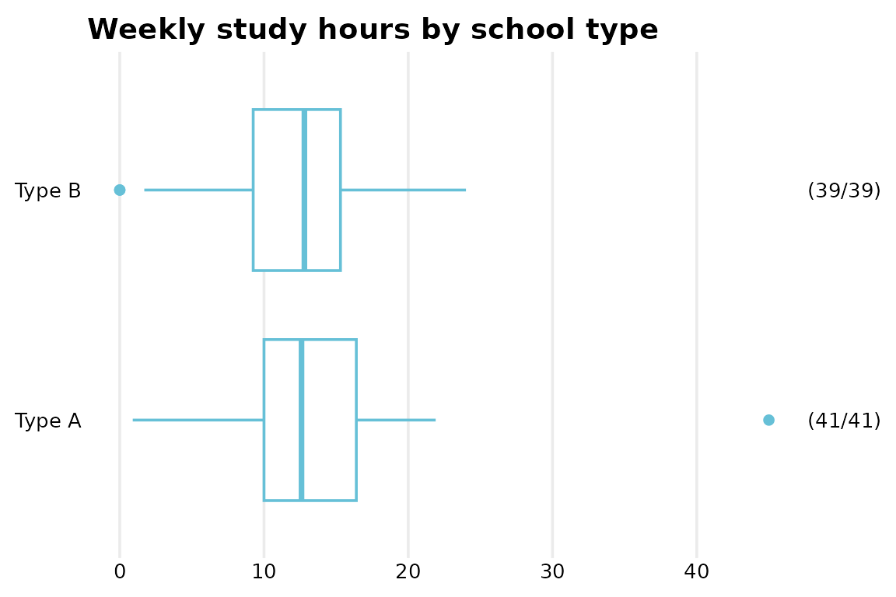

As with stacked bars, the data can be filtered before being passed to
the plotting function (to allow for routing or simply to focus on a
particular subset of respondents). Here I show how to use the colour
argument to the function to control the colour of the boxplot.

``` r

survey_data |>
  filter(gender=="Female") |>
OME_boxplot(
  value_var = study_hours,
  group_var = school_type,
  titleText = "Weekly study hours by school type",
  colour = "#2244AA"
)
```

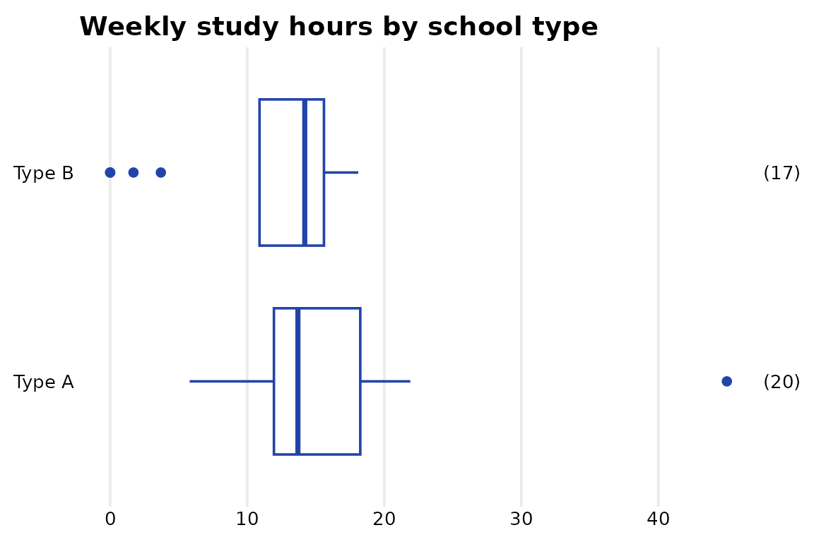

### Multi-question numeric plot with `summary_plot_boxplot()`

[`summary_plot_boxplot()`](https://jake-powell.github.io/OMESurvey/reference/summary_plot_boxplot.md)
summarises several numeric questions in one horizontal boxplot. Here we
compare study hours, wellbeing, and confidence.

``` r

numeric_labels <- c(
  wellbeing_score = "Wellbeing score",
  confidence_score = "Confidence score"
)

survey_data |>
  dplyr::select(study_hours, wellbeing_score, confidence_score) |>
  summary_plot_boxplot(
    labels_vec = numeric_labels,
    titleText = "Numeric survey measures"
  )
```

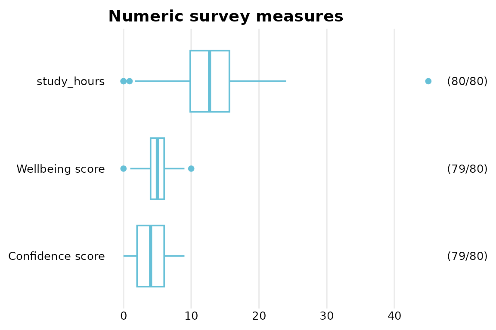

#### Ordering of questions

By default, the questions are ordered by their median value. To keep the
original variable order instead, set `order_fun = NULL`. (`mean` also
works here.)

``` r

survey_data |>
  dplyr::select(wellbeing_score, confidence_score) |>
  summary_plot_boxplot(
    labels_vec = numeric_labels,
    order_fun = NULL,
    titleText = "Numeric survey measures in original order"
  )
```

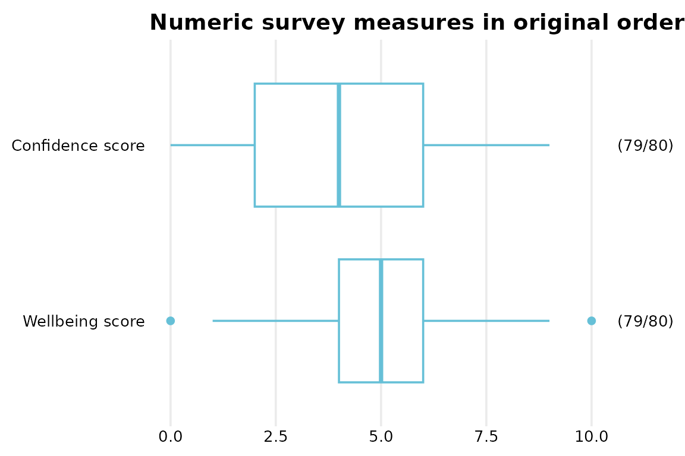

#### Dealing with survey routing

This is essentially the same as for the stacked bar charts. Use
[`make_extended_summary_plot_data()`](https://jake-powell.github.io/OMESurvey/reference/make_extended_summary_plot_data.md)
to take the survey data and set up `*_value`, `*_include` and `*_plot`
columns for each variable, then
[`summary_plot_boxplot()`](https://jake-powell.github.io/OMESurvey/reference/summary_plot_boxplot.md)
to plot.

### Other tweaking for boxplots

Unless otherwise stated, these methods are applicable to plots created
with both
[`OME_boxplot()`](https://jake-powell.github.io/OMESurvey/reference/OME_boxplot_.md)
and
[`summary_plot_boxplot()`](https://jake-powell.github.io/OMESurvey/reference/summary_plot_boxplot.md).

#### Font size

The `base_size` option works for boxplots too:

``` r

survey_data |>
  OME_boxplot(
    study_hours,
    school_type,
    base_size = 18
  )
```

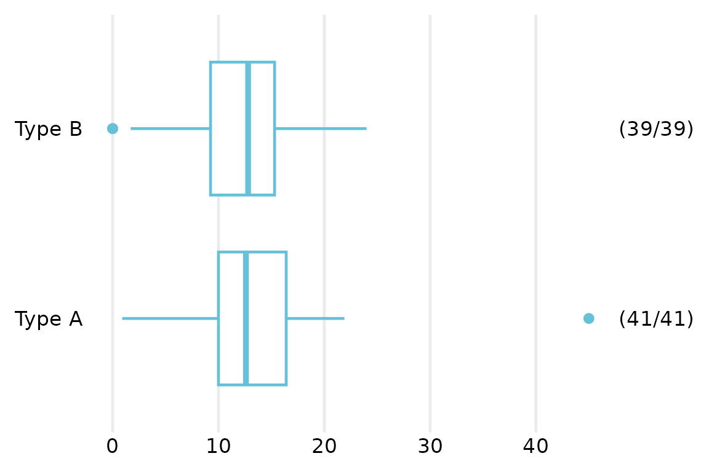

#### Label text wrapping

If labels are particularly long then changing the way they are wrapped
can be helpful to make the plot easier to read. This is more likely to
be an issue with larger text size too.

The `group_label_width` option controls how many characters wide the
grouping labels should be. For example:

``` r

survey_data |>
  dplyr::select(wellbeing_score, confidence_score) |>
  summary_plot_boxplot(
    labels_vec = numeric_labels,
    order_fun = NULL,
    group_label_width = 10
  )
```

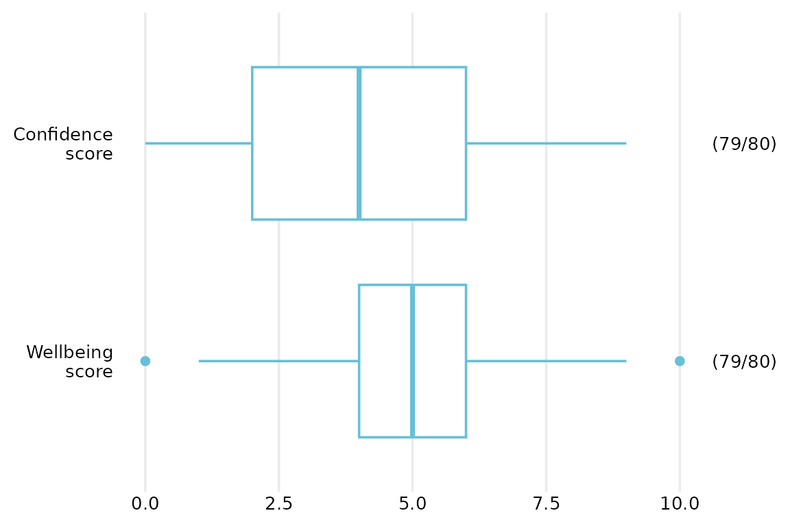

#### Setting scale limits and/or guide values

If the numerical variables being plotted are percentages then it might
make sense to insist that the scale runs from 0 to 100 and that the
guide lines should be at multiples of 25. Here’s an example where
manually specifying the scale doesn’t make much sense, but nevertheless
shows how it can be done. (Note that using just one of `coord_cartesian`
and `scale_x_continuous` will work too.)

``` r

survey_data |>
  OME_boxplot(
    study_hours,
    school_type
  ) +
  coord_cartesian(xlim = c(0, 50)) +
  scale_x_continuous(breaks = seq(0, 50, by = 12.5))
```

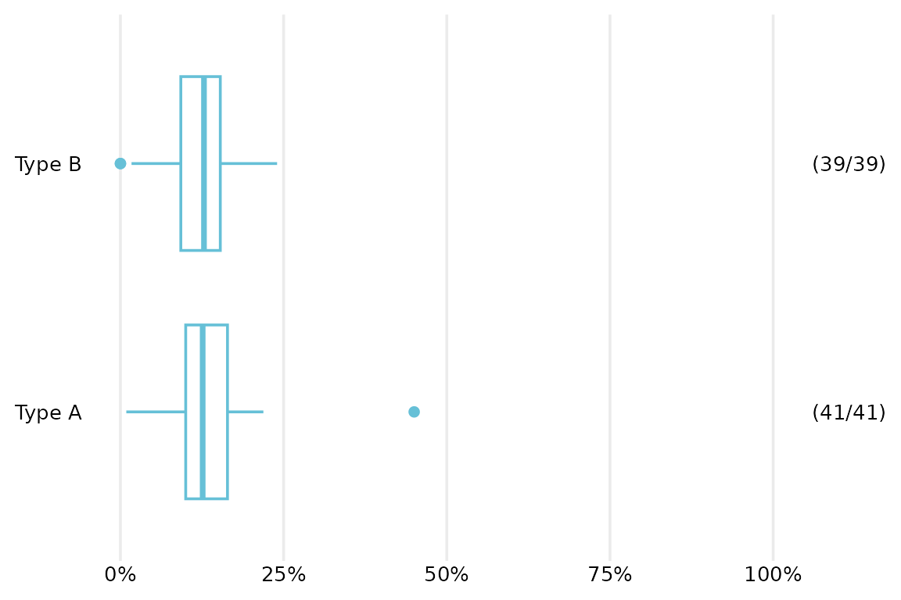

## A generic theme and colour palettes

For other kinds of plots, I have made

- a ggplot2 theme that should make plots in an OME kind of way, and
- fill & colour scales that use the get_OME_colours() colour palettes.

### Generic theme `theme_OME()`

If I make some other kind of plot and want it to be OME-ey, then I can
apply the theme `OME_theme()`.

``` r

survey_data |>
  ggplot(aes(x = confidence_score,
             y = wellbeing_score)) +
  geom_point(position = 'jitter',
             alpha = 0.8) +
  labs(x = "Confidence score",
       y = "Wellbeing score") +
  coord_cartesian(xlim=c(0,10), ylim=c(0,10)) +
  theme_OME()
#> Warning: Removed 2 rows containing missing values or values outside the scale range
#> (`geom_point()`).
```

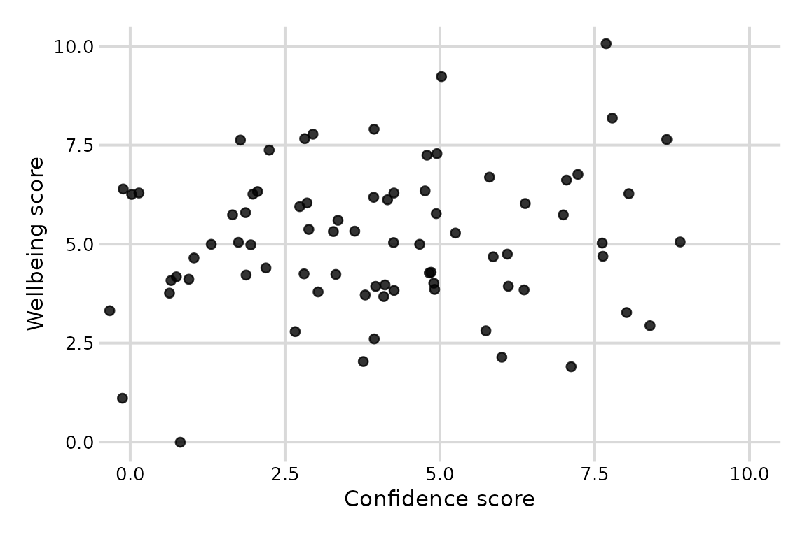

The theme is not meant to be prescriptive, but equally it is intended to
be a strong steer re plot formatting. It should be fine most of the
time, but certainly there will be some situations where it needs
changing. Change should be avoided unless it’s necessary, but equally if
it’s necessary to change then do it!

### Colour and fill scales `scale_colour_OME()` and `scale_fill_OME()`

And if I use colour then I can set the colour scale to be on-brand too.
(This scale also encourages the OME-ey style by removing the title in
the legend, by default.)

``` r

survey_data |>
  ggplot(aes(x = confidence_score,
             y = wellbeing_score,
             colour = school_type)) +
  geom_point(position = 'jitter',
             alpha = 0.8) +
  labs(x = "Confidence score",
       y = "Wellbeing score") +
  coord_cartesian(xlim=c(0,10), ylim=c(0,10)) +
  theme_OME() +
  scale_colour_OME()
#> Warning: Removed 2 rows containing missing values or values outside the scale range
#> (`geom_point()`).
```

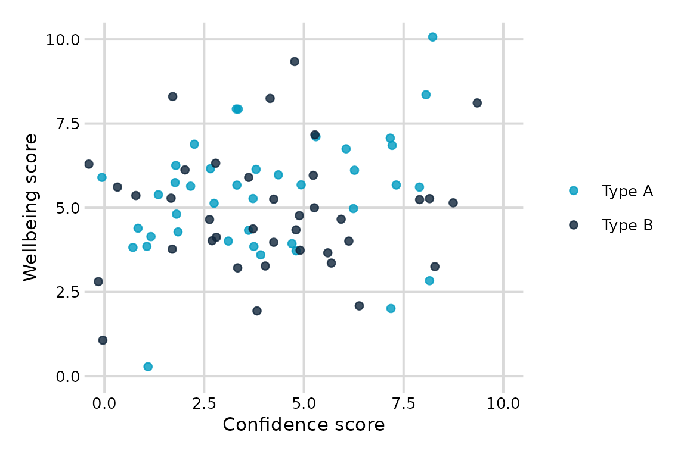

It defaults to using the ‘distinct’ palette, but the other options
(‘divergent’/‘sequential’) can work too, e.g. using
`scale_colour_OME(type='sequential')`.

``` r

survey_data |>
  ggplot(aes(x = confidence_score,
             y = wellbeing_score,
             colour = school_type)) +
  geom_point(position = 'jitter',
             alpha = 0.8) +
  labs(x = "Confidence score",
       y = "Wellbeing score") +
  coord_cartesian(xlim=c(0,10), ylim=c(0,10)) +
  theme_OME() +
  scale_colour_OME(type='sequential')
#> Warning: Removed 2 rows containing missing values or values outside the scale range
#> (`geom_point()`).
```

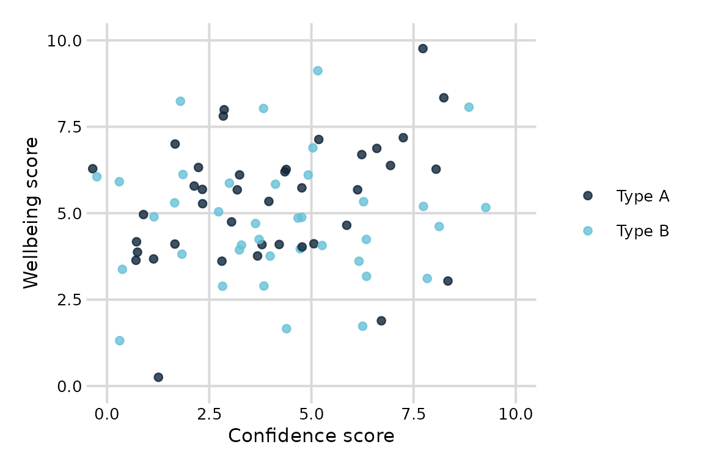

And the same sort of thing can be achieved for the `fill` aesthetic:

``` r

survey_data |>
  ggplot(aes(x = school_type,
             fill = gender)) +
  geom_bar() +
  labs(x = NULL,
       y = "Count") +
  theme_OME() +
  theme(panel.grid.major.x = element_blank()) +
  scale_fill_OME()
```

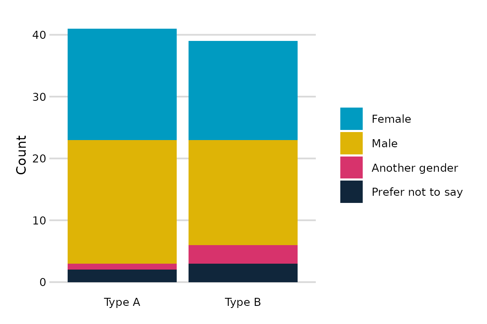

## Other useful things

### Advice re saving plots

Broadly speaking, I suggest saving in .svg (a vector graphics format)
rather than .png/.jpeg (or a similar raster graphics format). Vector
graphics (i) are usually much smaller files and (ii) can cope with
moderate amounts of resizing without much complaint, since they contain
the actual info needed to draw the plot rather than a list of pixels and
what colour they should be, which can get untidy-looking if the size
and/or proportions are changed. The exception is for something with
loads of different elements like a scatter plot with thousands of
points - then a vector graphics file might be unreasonably large.

For plots made using `ggplot`,

``` r

ggsave("some_file_name.svg", width=4, height=5, units="in")
```

will save the current plot in RStudio, or if you have the plot saved in
R (through something like `my_plot <- make_plot(…)` then

``` r

ggsave("some_file_name.svg", my_plot, width=4, height=5, units="in")
```

will do the job. The units can be changed to “cm” (or “mm” or “px”
\[pixels\]) if you prefer.

If you need to use . png then you just need to (a) change the filename
to end “.png” instead of “.svg” and (b) add the option `dpi = 300`. I.e.

``` r

ggsave("some_file_name.png", width=4, height=5, units="in", dpi=300)
```

(And there’s the same ability to use the version with `my_plot` if you
have saved the plot in your R session.)

Note that these files will be saved in the current working directory. If
you use an RStudio project structure then this will probably be the same
directory that the .Rproj project file is in; but if in doubt you can
check using [`getwd()`](https://rdrr.io/r/base/getwd.html) or provide a
specific path to
[`ggsave()`](https://ggplot2.tidyverse.org/reference/ggsave.html),
e.g. `"C:/<all sorts of stuff>/some_file_name.svg"`, instead of just a
file name.

### Sizing

When you make a plot you don’t know exactly how big you’ll want it to
be - pagination in a document (especially a large one like RoME!) is
often fluid right until the end. I suggest, in the first instance,
relatively quickly picking a size that looks reasonable - accepting
that, later on, re-saving with a different sizing might well be needed.
All the more reason to keep code well-organised so it can easily be
found/reviewed/tweaked/re-run.

### Reordering factors

There is a nice way of reordering factors which is sometimes very handy
when making plots. For example, suppose we want (for some reason) to do
a catterpillar plot of every individual’s wellbeing score. A caterpillar
plot is just a scatterplot with fancy ordering (noting the need to
[`filter()`](https://dplyr.tidyverse.org/reference/filter.html) to avoid
`NA`s messing things up):

``` r

survey_data |>
  filter(!is.na(wellbeing_score)) |>
  ggplot(aes(x = forcats::fct_reorder(respondent_id_asis, wellbeing_score),
             y = wellbeing_score)) +
  geom_point() +
  labs(x = "Respondent",
       y = "Wellbeing score") +
  theme_OME() +
  theme(panel.grid.major.x = element_blank()) +
  scale_x_discrete(breaks=NULL)
```

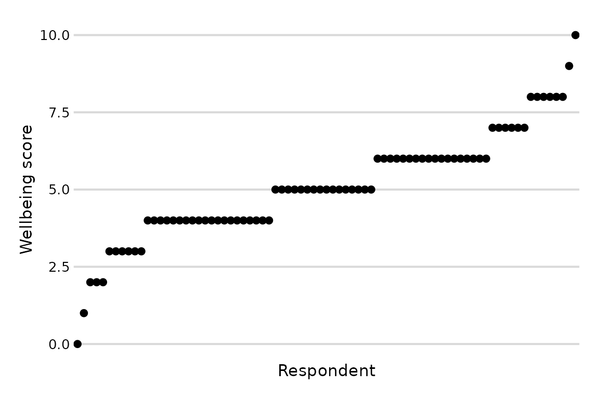

The `fct_reorder()` function can also do lots of other cool things - the
help provides a couple of examples.

### more…

… more to come here soon, including

- general plot design/formatting principles (from RoME ’25 planning)
- using patchwork and/or cowplot to put plots together and consolidate
  legends (as appropriate)
- other things too maybe…

## Still coming…

There will also, in due course, be additional functions to do other
common(ish)ly needed types of plots.

``` r

knitr::knit_exit()
```
